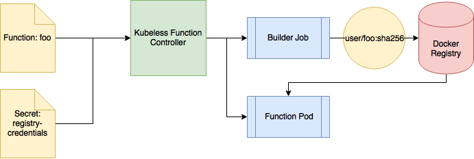

# Kubeless building process for functions

Kubeless includes a way of building and storing functions as docker images. This can be used to:

 - Persistent function storage.
 - Speed the process of redeploying the same function. This is specicially useful for scalling your function.
 - Generate immutable function deployments. Once a function image is generated, the same image will be used every time the function is used.

## Setup the build process

In order to setup the build process the only steps needed are:

 1. Generate a Kubernetes [secret](https://kubernetes.io/docs/concepts/configuration/secret) with the credentials required to push images to the docker registry and enable the build st. In order to do so, `kubectl` has an utility that allows you to create this secret in just one command:

| **Note**: The command below will generate the correct secret only if the version of `kubectl` is 1.9+ 

```console
kubectl create secret docker-registry kubeless-registry-credentials \
  --docker-server=https://index.docker.io/v1/ \
  --docker-username=user \
  --docker-password=password \
  --docker-email=user@example.com
```

If the secret has been generated correctly you should see the following output:

```console
$ kubectl get secret kubeless-registry-credentials --output="jsonpath={.data.\.dockerconfigjson}" | base64 -d

{"auths":{"https://index.docker.io/v1/":{"username":"user","password":"password","email":"user@example.com","auth":"dGVfdDpwYZNz"}}}
```

 2. Enable the build step in the Kubeless configuration. If you have already deploy Kubeless you can enable it editing the configmap. You will need to set the property `enable-build-step: "false"` to `"true"`:

 ```console
 kubectl edit configmaps -n kubeless kubeless-config
 ```

 3. Once the build step is enabled you need to restart the controller in order for the changes to take effect:

 ```console
 kubectl delete pod -n kubeless -l kubeless=controller
 ```

Once the secret is available and the build step is enabled Kubeless will automatically start building function images.

## Build process

The following diagram represents the building process:



When a new function is created the Kubeless Controller generates two items:
 
 - A [Kubernetes job](https://kubernetes.io/docs/concepts/workloads/controllers/jobs-run-to-completion/) that will use the registry credentials to push a new image under the `user` repository. It will use the checksum (SHA256) of the function specification as tag so any change in the function will generate a different image.
 - A Pod to run the function. This pod will wait until the previus job finishes in order to pull the function image.

## Known limitations

 - It is only possible to use a single registry to pull images and push them so if the build system is used with a registry different than https://index.docker.io/v1/ (the official one) the images present in the Kubeless ConfigMap should be copied to the new registry.
 - Base images are not currently cached, that means that every time a new build is triggered it will download the base image.
 